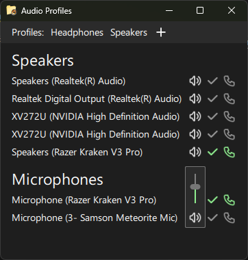

# Audio Profiles

Audio Profiles is a Windows application that allows you to manage both standard and communication default audio devices for speakers and microphones all from a single screen. These defaults can then be saved in profiles that can be loaded in a single click.

## Features

* Supports speakers and microphones
* Set default devices for standard and communication audio
* Set both defaults by clicking the device name
* Change speaker and microphone volumes
* Mute speakers and microphones
* Store default audio device settings in profiles
* All visible on a single page

## Screenshot

## Deploying

Audio Profiles is built using Qt and Qt Creator. The installer is build using NSIS.

Set the profile's build directory to "build" (so the build script functions) and enable Qt Quick Compile. To create the deploy folder, run the `deploy.bat` script. This scripts runs `windeployqt.exe` to create a folder with the necessary files. The script with then run `makensis` to create the installer.
